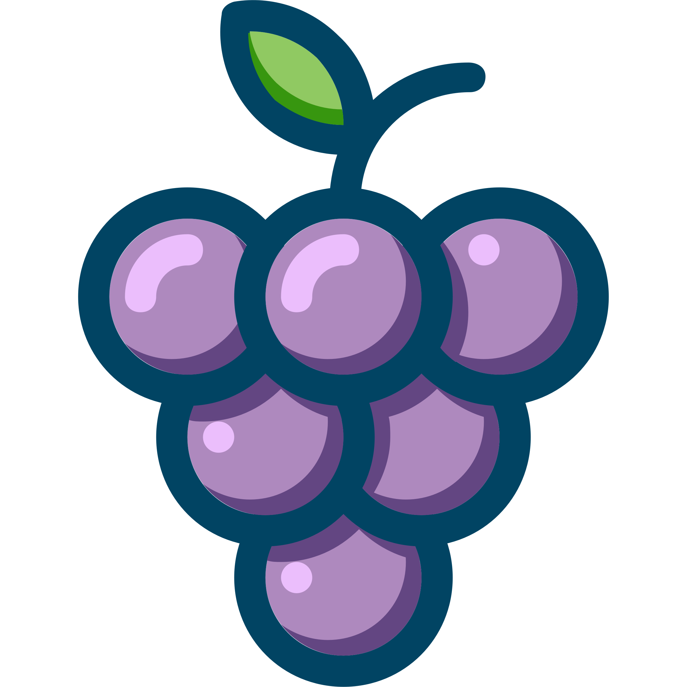

[](https://travis-ci.org/vinbero/vinbero)
<p align="center"></p>

## Intoduction
Vinbero is a modular server written in C, and its main goal is flexibility. Its core is very small; It just loads children modules, initializes them, calls callbacks on them and destroys them. Currently multithreading, tcp, epoll, http, lua module exist. So you can try it as a simple web application server with lua scripting. But if you add your own module it could be even used as a mailserver, chatserver or gameserver.

## Warning
**Currenttly this software is under heavy development, so there will be bugs or the architecture can change.
Writing new modules is not encouraged yet.**

## Usage
```console
Usage: vinbero [OPTION]...
A Modular Server.
Options:
  -i --inline-config       Inline JSON-based config.
  -c --config-file         JSON-based config file.
  -f --logging-flag        Set logging level flag.
  -o --logging-option      Set logging option.
  -h --help                Print this help message.
```

<a href="https://asciinema.org/a/188477" target="_blank"></a>

### Config file example
```JSON
{
    "core": {
        "config": {"vinbero.setUid": 1001},
        "next": ["vinbero_tcp"]
    },
    "vinbero_tcp": {
        "path": "/usr/local/lib/vinbero/vinbero_tcp.so",
        "config": {"vinbero_tcp.port": 8000, "vinbero_tcp.reuseAddress": true},
        "next": ["vinbero_mt"]
    }, 
    "vinbero_mt": {
        "path": "/usr/local/lib/vinbero/vinbero_mt.so",
        "config": {"vinbero_mt.workerCount": 4},
        "next": ["vinbero_tcp_mt_epoll"]
    },
    "vinbero_tcp_mt_epoll": {
        "path": "/usr/local/lib/vinbero/vinbero_tcp_mt_epoll.so",
        "config": {},
        "next": ["vinbero_mt_epoll_http"]
    },
    "vinbero_mt_epoll_http": {
        "path": "/usr/local/lib/vinbero/vinbero_mt_epoll_http.so",
        "config": {},
        "next": ["vinbero_mt_http_lua"]
    },
    "vinbero_mt_http_lua": {
        "path": "/usr/local/lib/vinbero/vinbero_mt_http_lua.so",
        "config": {
            "vinbero_mt_http_lua.scriptFile": "test/test.lua",
            "vinbero_mt_http_lua.scriptArg": {}
        },
        "next": []
    }
}
```

### Logging flags and Logging options
Logging flags and logging options are integer bitmasks:

- FLAG_TRACE: 1
- FLAG_DEBUG: 2
- FLAG_INFO: 4
- FLAG_WARN: 8
- FLAG_ERROR: 16
- FLAG_FATAL: 32
- **default logging flag is 62**
- OPTION_COLOR: 1
- **defualt logging option is 1**

### Core module config options
- vinbero.setUid (***int***) : Change uid after module initialization.
- vinbero.setGid (***int***) : Change gid after module initialization.

## History
It is initially started as a hobby project by Byeonggon Lee at Jul, 2016.
There have been many architectural changes for two years.

## License
MPLv2

## Contribution guide
Any type of contribution is welcome!
Radical changes like function renaming or small changes like removing extra spacing is allowed too.
Please don't hesitate to fork and contribute, this project needs a lot of work to do.

### Naming convention
#### Modules
Module names are snake case, and should be start with vinbero_

##### examples:
```C
vinbero_mt_epoll_http
vinbero_mt
```

#### Interfaces
Interface names are snake case and should start with vinbero_interface and **interface part** must be **uppercase with underscore**.

##### examples:
```C
vinbero_interface_HTTP
```

#### Structs
Struct names are pascal case and start with module names or interface names.
##### examples: 
```C
struct vinbero_mt_epoll_http_Module;
struct vinbero_mt_epoll_http_ParserData;
```

#### Functions
Function names are camel case and start with struct names if it act like methods, or start with module names or interface names.
##### examples:
```C
int vinbero_tcp_mt_epoll_loadChildClModules(struct vinbero_common_ClModule* clModule);
int vinbero_interface_HTTP_onRequestStart(struct vinbero_common_ClModule* clModule);
```

#### Macros
Macro naming is same as C macros (uppercase with underscore). But it also starts with module names or interfaces names.
#### examples:
```C
#define VINBERO_INTERFACE_HTTP_DLSYM(interface, dlHandle, ret)
```

#### Variables
Struct variable names are same as function names. but local variables don't start with module names

#### Reserved namespaces
- vinbero_core
- vinbero_common
- vinbero_interface
- vinbero_global
- vinbero_static
- vinbero_local

### Versioning
This project follows **semantic versioning**.
https://semver.org

### Branching
This project and all sub-projects are going to follow this branching model after vinbero v0.1.0 release.
**https://nvie.com/posts/a-successful-git-branching-model**

### Slack
https://vinbero.slack.com

